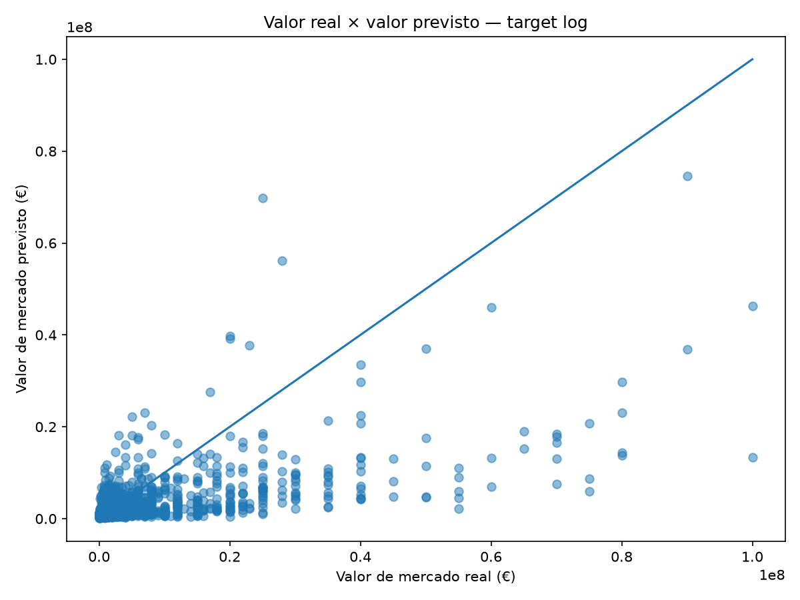

# Football Player Value Predictor

Projeto de Machine Learning para estimar o valor de mercado de jogadores de futebol a partir de características básicas de desempenho.

O projeto foi desenvolvido como uma aplicação simples de regressão linear utilizando dados reais de jogadores.

## Live Demo

A aplicação está disponível publicamente em:

**https://football-player-value-predictor.streamlit.app**

A interface permite inserir os dados de um jogador e obter uma estimativa de valor de mercado, além de consultar métricas de desempenho e limitações do modelo.

## Objetivo

Estimar o valor de mercado de um jogador utilizando cinco características:

- idade;
- posição;
- minutos jogados;
- gols;
- assistências.

O objetivo do projeto é demonstrar, de forma simples e interpretável, um pipeline completo de Machine Learning:

```text
dados → preparação → treinamento → avaliação → previsão
```

## Tecnologias

- Python
- pandas
- NumPy
- scikit-learn
- matplotlib
- joblib
- Streamlit

## Estrutura do projeto

```text
football-player-value-predictor/
│
├── data/
│   ├── raw/
│   └── processed/
│
├── models/
│   └── market_value_model.joblib
│
├── reports/
│   └── figures/
│       ├── actual_vs_predicted.png
│       └── actual_vs_predicted_log_target.png
│
├── src/
│   ├── prepare_data.py
│   ├── train_model.py
│   ├── evaluate_model.py
│   └── predict.py
│
├── app.py
├── MODEL_CARD.md
├── DEVELOPMENT.md
├── PROJECT_CONTEXT.md
├── README.md
├── requirements.txt
└── .gitignore
```

## Dados

Os dados utilizados são provenientes do projeto público `dcaribou/transfermarkt-datasets`.

Foram utilizados dois arquivos:

- `players.csv.gz`
- `appearances.csv.gz`

As estatísticas de desempenho foram agregadas por jogador no período entre **01/07/2025 e 12/06/2026**.

O dataset processado contém:

- `age`
- `position`
- `minutes`
- `goals`
- `assists`
- `market_value_in_eur`

Após a preparação dos dados, a amostra final ficou com **8.187 jogadores**.

Os arquivos brutos e o dataset processado não são armazenados no repositório.

## Modelo

O modelo utilizado é uma regressão linear implementada com `scikit-learn`:

```python
LinearRegression()
```

A variável `position` é transformada com `OneHotEncoder`.

Como os valores de mercado apresentam uma distribuição bastante assimétrica, o target é transformado antes do treinamento:

```python
np.log1p(market_value_in_eur)
```

Após a previsão, o resultado retorna à escala original em euros:

```python
np.expm1(prediction)
```

## Avaliação

Os dados foram divididos em:

- **80%** para treinamento;
- **20%** para teste;
- `random_state=42`.

Isso resultou em:

| Conjunto | Jogadores |
|---|---:|
| Treino | 6.549 |
| Teste | 1.638 |
| Total | 8.187 |

### Primeiro experimento: target direto em euros

O primeiro modelo foi treinado diretamente com o valor de mercado em euros.

| Métrica | Resultado |
|---|---:|
| MAE | €5.648.020 |
| R² | 0,3462 |

### Modelo com target logarítmico

Após aplicar a transformação logarítmica ao target:

| Métrica | Resultado |
|---|---:|
| MAE | €4.276.655 |
| R² em euros | 0,2867 |

A transformação reduziu o **MAE em aproximadamente 24%**, indicando menor erro absoluto médio para o conjunto de teste.

O modelo com target logarítmico foi mantido como modelo final deste MVP.

### Comparação com baseline ingênuo

Para verificar se o modelo realmente acrescenta valor em relação a uma previsão simples, foi utilizado como baseline prever sempre a mediana do valor de mercado do conjunto de treino.

| Métrica | Resultado |
|---|---:|
| Valor constante do baseline | €1.500.000 |
| MAE do baseline | €5.195.650 |
| MAE do modelo | €4.276.655 |
| Melhoria sobre o baseline | 17,7% |

O modelo reduziu o erro absoluto médio em **17,7%** em comparação com esse baseline.

### Distribuição dos erros

No conjunto de teste:

- 50% das previsões apresentaram erro absoluto de até **€1,08 milhão**;
- 80% apresentaram erro de até **€4,74 milhões**;
- 90% apresentaram erro de até **€11,98 milhões**.

Esses valores representam a distribuição empírica dos erros no conjunto de teste e não devem ser interpretados como intervalos de confiança.

## Visualização

O projeto gera um gráfico comparando o valor de mercado real com o valor previsto:



A linha diagonal representa uma previsão perfeita. Pontos distantes da linha indicam maior erro de previsão.

O gráfico também evidencia uma limitação do modelo: jogadores de valor muito elevado tendem a ter seus valores subestimados.

## Como executar

### 1. Criar o ambiente virtual

No Windows:

```powershell
py -3.11 -m venv .venv
.\.venv\Scripts\Activate.ps1
```

### 2. Instalar as dependências

```powershell
python -m pip install -r requirements.txt
```

### 3. Preparar os dados

Coloque os arquivos brutos em:

```text
data/raw/
```

Depois execute:

```powershell
python src\prepare_data.py
```

O dataset processado será criado em:

```text
data/processed/players_model.csv
```

### 4. Treinar o modelo

```powershell
python src\train_model.py
```

O treinamento:

- avalia o modelo;
- gera o gráfico;
- salva o modelo treinado.

O arquivo do modelo é salvo em:

```text
models/market_value_model.joblib
```

### 5. Fazer uma previsão

Execute:

```powershell
python src\predict.py
```

O programa solicitará:

```text
Idade
Posição
Minutos jogados
Gols
Assistências
```

As posições aceitas são:

```text
Attack
Midfield
Defender
Goalkeeper
```

A entrada não diferencia letras maiúsculas e minúsculas.

## Exemplo

Entrada:

```text
Idade: 21
Posição: Attack
Minutos jogados: 3000
Gols: 18
Assistências: 10
```

Resultado obtido:

```text
Valor de mercado estimado: €46.859.871
```

Esse valor é apenas uma estimativa produzida pelo modelo a partir das cinco características fornecidas.

## Limitações

Este é um projeto educacional e utiliza deliberadamente um conjunto pequeno de variáveis.

O modelo não considera fatores como:

- clube;
- liga;
- duração do contrato;
- reputação;
- potencial futuro;
- contexto econômico;
- condições específicas de negociação.

Esses fatores podem ter grande influência no valor de mercado de um jogador.

O objetivo não é reproduzir modelos profissionais de avaliação de atletas, mas demonstrar uma aplicação simples e completa de regressão em dados reais de futebol.

## Status

**MVP concluído e publicado.**

O projeto atualmente permite:

- preparar dados reais de jogadores;
- treinar uma regressão linear;
- transformar o target com `log1p`;
- avaliar o modelo em conjunto de teste;
- comparar o desempenho com um baseline ingênuo;
- analisar a distribuição dos erros;
- avaliar desempenho por faixa de valor;
- gerar visualizações;
- persistir o modelo treinado;
- realizar previsões via terminal;
- realizar previsões por uma interface Streamlit;
- consultar métricas e limitações do modelo;
- acessar a aplicação publicamente pela web.

Live demo:

**https://football-player-value-predictor.streamlit.app**